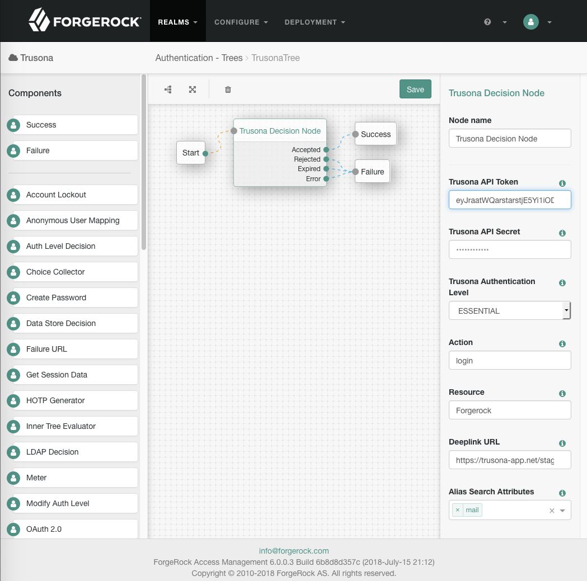
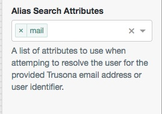

# ForgeRock AM Authentication Node

## Supported Versions

The Trusona AM Authentication node is developed against and supported on version 6.5 of ForgeRock AM. For older versions of ForgeRock AM, Trusona also has a [ForgeRock AM Authentication Module](https://github.com/trusona/forgerock-module).

## Installation

To install the Trusona Forgerock Node, download the latest `trusona-forgerock-node-x.x.x-all.jar` from the [releases page](https://github.com/trusona/forgerock-node/releases), copy the jar into `WEB-INF/lib/` where AM is deployed, and then restart AM or the container in which it runs. See [Building and Installing Authentication Nodes](https://backstage.forgerock.com/docs/am/6/authentication-guide/#installing-custom-auth-nodes) for more details on installing custom authentication nodes.

## Configuration

Before configuring the node, make sure you have your Trusona API token and secret. You will need to provide these values to the node so it can create Trusonafications. For steps on how to configure Authentication Trees and Nodes, see the [ForgeRock AM docs](https://backstage.forgerock.com/docs/am/6/authentication-guide/#sec-configure-authentication-trees). When you are adding the Trusona Authentication Node to a Tree, you will need to provide the following configuration values:

1. Trusona API Token - The API token you received from Trusona. This will be used to authenticate your node to Trusona's backend services.
1. Trusona API Secret - The API secret you received from Trusona. This will be used to authenticate your node to Trusona's backend services.
1. Authentication Level - The level that you want to authenticate the user at.
1. Action - A string that will be used in the action field of a Trusonafication. See the following section for more details.
1. Resource - string that will be used in the resource field of a Trusonafication. See the following section for more details.
1. Deeplink URL - The URL that the user will be redirected to when they are on a mobile browser. This URL should be handled by the mobile app users will authenticate with. If not set, the user will be sent to the Trusona App.
1. Alias Search Attributes - A list of attributes to use when looking up a ForgeRock user for a Trusona email address or `userIdentifier`. See [Mapping Trusona Users to ForgeRock Subjects](#mapping-trusona-users-to-forgerock-subjects) below for more information.

### Authentication Level
Trusona supports two levels of authentication. The default level is Essential, which requires device security only (pin or biometric to unlock device). The Executive
level is also supported, which requires the user to also scan their driver's license.

### The Action and Resource fields

When you attempt to authenticate a user with this node, a Trusonafication will be issued for the user. The Accept/Reject screen for the Trusonafication will use the action and resource to display a sentence in the format "$customer_name would like to confirm your $action to $resource". So if you configure Action to be "login", and your Resource to be "ForgeRock", the sentence will read "$customer_name would like to confirm your login to ForgeRock"

### Node Outcomes

The node has four different Outcomes. They are as follows:

1. Accepted - The user successfully accepted the issued Trusonafication. They have been authenticated by Trusona.
1. Rejected - The user rejected the issued Trusonafication. This means the user explicitly chose to deny this authentication request.
1. Expired - The Trusonafication expired before a response was received from the user. This should be handled as a failed authentication attempt.
1. Error - A fatal error occurred during the authentication attempt. If this happens check the `TrusonaAuth` debug logs to determine the cause and contact Trusona Support if needed.

### Example Node Configuration

### Mapping Trusona Users to ForgeRock Subjects

To map your Trusona account to your ForgeRock profile, you'll provide one or more Alias Search Attributes to map your Trusona identifier to a ForgeRock identifier. To do this, in your node configuration, edit `Alias Search Attributes` to include the LDAP attribute that contains your Trusona identifier. The Trusona identifier may be different depending on how you are using Trusona (Trusona App vs Trusona SDK).
*Note:* The Trusona Node is unable to access the Realm wide configuration `Alias Search Attribute Names` that the Trusona Module uses to map Trusona Users to ForgeRock Subjects. You must use the Node level configuration `Alias Search Attributes` instead.

#### Mapping Users Registered with the Trusona App

The Trusona App uses verified email addresses as the user's identifiers. To map a Trusona App user, you can enter the `mail` LDAP attribute and it will look for ForgeRock profiles that contain a matching `Email Address`. See the screenshot below:

#### Mapping Users Registered with the Trusona SDK

If you are using the Trusona SDK within your own app, the Trusona identifier will be the `userIdentifier` that you used when you activated the user's device. If you registered the user using their ForgeRock ID then the mapping will automatically work. If you registered the user's email address, you can set it up to use `mail` and it will work the same as the Trusona App. Finally, if you are using a different type of identifier, you will need to ensure that the ID you registered with Trusona is represented as a field in the user's ForgeRock profile and the appropriate LDAP attribute is used as a search alias. One  way to do a custom mapping like this would be to add your identifier to the user's `User Alias List` in their profile, and then configure the `Alias Search Attributes` to use the LDAP attribute `iplanet-am-user-alias-list`.

Alternatively, you could also consult the OpenAM documentation to add [custom profile attributes](https://backstage.forgerock.com/docs/am/5.5/maintenance-guide/#sec-maint-datastore-customattr) to store your identifier.

## Usage

The node comes with a front end JavaScript app that handles the rendering of TruCodes, and redirecting users to their Trusona supported mobile apps when used with ForgeRocks' XUI. The following sections describe how the node works for both Desktop and Mobile users.

### Desktop Users

Desktop users will see a TruCode in their browser that they will need to scan with their Trusona enabled mobile app. They will then receive a Trusonafication, which they can either accept or reject. If they accept, the node will continue down the `Accepted` outcome path.

### Mobile Users
On mobile devices, instead of seeing a TruCode, users will be deeplinked into their Trusona enabled mobile app, where they will be presented with a Trusonafication. Once accepted, the app will send the user back to the browser, where the node will continue down the `Accepted` outcome path.

## Note
When a user authenticates with Trusona, the username field is populated in shared state, which may overwrite any value put there by any other node that executed before Trusona.